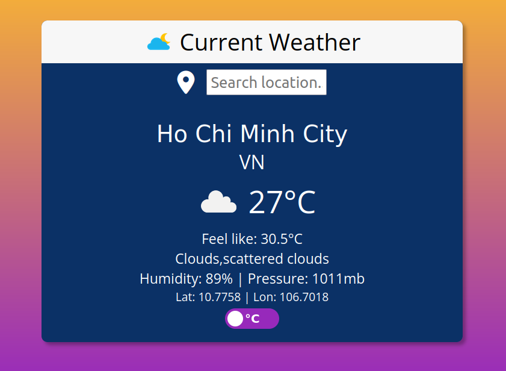

# Weather App

Check current weather with search location or gps.

## Live Demo

https://truongwerk.github.io/Weather-App/ 

## Features

- Search location with geocoding api.
- Get location with gps with reverse geocoding api.
- Check current weather with weather api.
- Celsius to fahrenheit and vice versa toggle.

## Build with
- Use https://openweathermap.org/ api.
- Vanilla javascript and css.
- Bundle with Webpack and Babel.
- Linting with ESlint and prettier.
## License

[MIT](https://choosealicense.com/licenses/mit/)

